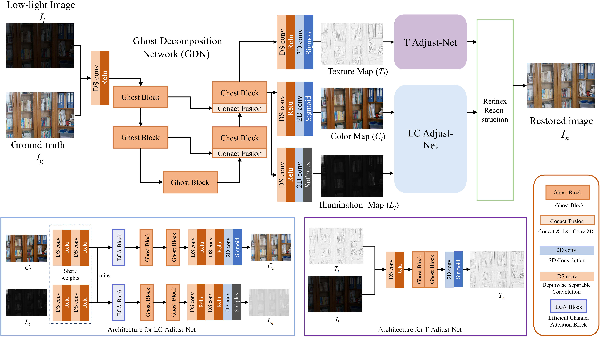

# GDNet
GDNet: A low-light image enhancement network based on Ghost-Block and unique image decomposition

## Recommended Environment:
 python = 3.7
 
 tensorflow-gpu = 1.9.0
 
 numpy = 1.15.4
 
 scipy = 1.2.0

# Framework:

## Test
just put your images into "dataset/test/demo/low" and run the test_LCR.py

## Result

# Enhanced Images
Enhanced images for different algorithms are [here](https://pan.baidu.com/s/17UvSI4k_Kq7xaknp2bEdaw?pwd=2vvd)
